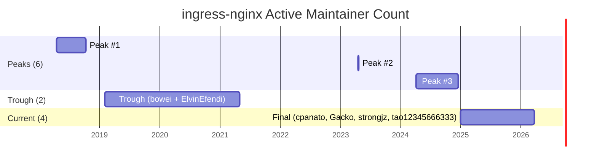
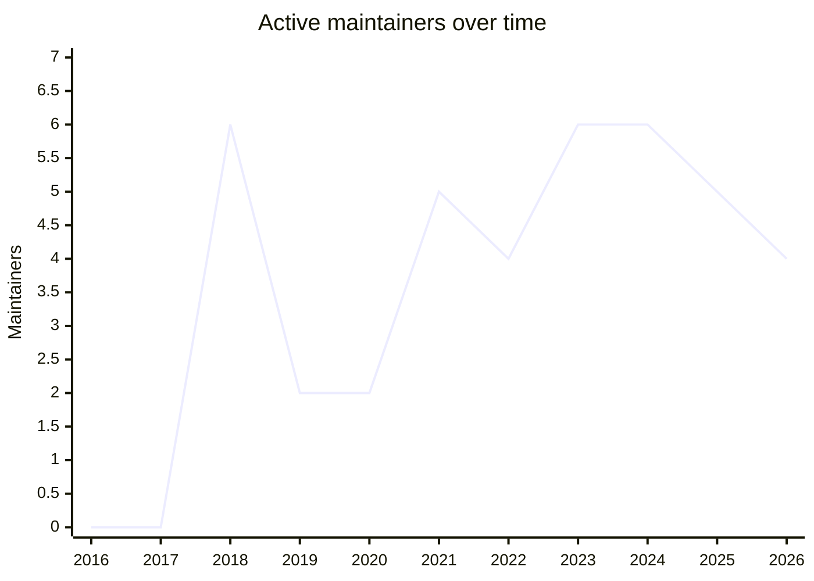

# ingress-nginx: Active Maintainer History

> Research notes for the **SRE Day 2026 Q2** talk. Compiled 2026-06-04 via
> `gh` CLI against `kubernetes/ingress-nginx` repo git history.
> All file contents are verbatim from the referenced commit SHAs.

## TL;DR

| Question | Answer |
|----------|--------|
| **Maximum active maintainers ever** | **6** |
| Times peak was reached | **3** (2018, 2023, 2024) |
| Minimum active maintainers (post-launch) | **2** (2019–2021, ~3 years) |
| Current at archival (2026-03-24) | **4** |
| Maintainers lost to emeritus since 2016 | **4** (aledbf, bowei, ElvinEfendi, rikatz) |

**Answer to "where could I see the max":** Three snapshots in `OWNERS` /
`OWNERS_ALIASES` git history — one in **April 2018**, one in **April 2023**,
and one spanning **April–December 2024**. Details in §3 below.

---

## 1. Method

I counted the **unique union of humans in any approver role** in the
`OWNERS` / `OWNERS_ALIASES` files at every commit, excluding
`sig-network-leads` (which were Kubernetes-sig-wide leads, not project
maintainers) and including anyone directly listed in the `approvers:`
list of `OWNERS` (e.g. `ElvinEfendi` and `antoineco` between 2018 and 2019).

The signal sources:

- `OWNERS` (17 commits total)
- `OWNERS_ALIASES` (18 commits total)
- `kubernetes/org` PRs that formally added/removed maintainers (#5305, #5318)

Git history commands used:

```bash
gh api 'repos/kubernetes/ingress-nginx/commits?path=OWNERS&per_page=100' \
    --jq '.[] | {sha: .sha[:10], date: .commit.author.date, message: .commit.message}'

gh api 'repos/kubernetes/ingress-nginx/commits?path=OWNERS_ALIASES&per_page=100' \
    --jq '.[] | {sha: .sha[:10], date: .commit.author.date, message: .commit.message}'

# Then for each commit:
gh api 'repos/kubernetes/ingress-nginx/contents/OWNERS?ref=<sha>'         -q '.content' | base64 -d
gh api 'repos/kubernetes/ingress-nginx/contents/OWNERS_ALIASES?ref=<sha>' -q '.content' | base64 -d
```

## 2. Timeline

| Date | Event | Active maintainers | Count |
|------|-------|--------------------|-------|
| 2016-11-05 | Project created | (assignees only: `aledbf, justinsb, bprashanth, thockin`) | 0 approvers |
| 2018-01-10 | First OWNERS+aliases format | `bowei, bprashanth, justinsb, aledbf, nicksardo` | 5 |
| **2018-04-13** | **"Add new approvers"** | `bowei, justinsb, aledbf, nicksardo, ElvinEfendi, antoineco` | **6** ⬅ peak #1 |
| 2018-10-08 | nicksardo, justinsb, bprashanth leave | `bowei, aledbf, ElvinEfendi, antoineco` | 4 |
| 2019-01-30 | antoineco, then justinsb leave | `bowei, ElvinEfendi` | **2** |
| 2019-11-08 | + cmluciano (reviewer only) | `bowei, ElvinEfendi` | 2 |
| 2020-04-02 | **aledbf steps down** (emeritus) | `bowei, ElvinEfendi` | 2 |
| 2020-12-25 | (confirmed in OWNERS) | `bowei, ElvinEfendi` | 2 |
| 2021-04-27 | rikatz, strongjz promoted | `bowei, ElvinEfendi, justinsb, rikatz, strongjz` | 5 |
| 2021-07-16 | justinsb drops out | `bowei, ElvinEfendi, rikatz, strongjz` | 4 |
| **2022-04-17** | **"Promote Jintao to maintainer"** | `bowei, ElvinEfendi, rikatz, strongjz, tao12345666333` | 5 |
| 2022-10-12 | bowei → emeritus | `ElvinEfendi, rikatz, strongjz` | 3 |
| **2023-04-20** | **"add puerco and cpanato as approvers"** | `ElvinEfendi, rikatz, strongjz, cpanato, puerco, tao12345666333` | **6** ⬅ peak #2 |
| 2023-04-23 | ElvinEfendi → emeritus | `rikatz, strongjz, cpanato, puerco, tao12345666333` | 5 |
| **2024-04-04** | **Gacko promoted** | `rikatz, strongjz, cpanato, puerco, tao12345666333, Gacko` | **6** ⬅ peak #3 |
| 2024-06-14 | Gacko also promoted to admin | (same) | 6 |
| 2024-12-15 | rikatz steps down | `strongjz, cpanato, puerco, tao12345666333, Gacko` | 5 |
| 2025–2026 | puerco goes inactive | `cpanato, Gacko, strongjz, tao12345666333` | 4 |
| 2026-03-24 | Archived | (unchanged) | 4 |

## 3. Where the max of 6 occurred

### Peak #1 — April 2018 (commit `25d1988c0f`, message "Update owners")

`OWNERS` at this commit:

```yaml
approvers:
- sig-network-leads
- ingress-nginx-admins
- ingress-nginx-maintainers
- ElvinEfendi
- antoineco

reviewers:
- aledbf
- ElvinEfendi
- antoineco
```

`OWNERS_ALIASES` at this commit:

```yaml
aliases:
  sig-network-leads:
  - caseydavenport
  - dcbw
  - thockin
  ingress-nginx-admins:
  - bowei
  - aledbf
  ingress-nginx-maintainers:
  - justinsb
  - aledbf
  - nicksardo
```

**The 6 active approvers** (excluding `sig-network-leads`):
`bowei, justinsb, aledbf, nicksardo, ElvinEfendi, antoineco`

This peak lasted **6 months** before collapsing: nicksardo, justinsb, and
bprashanth all left between June and October 2018.

### Peak #2 — April 2023 (commit `94a3264f1e`, message "add puerco and cpanato as approvers")

`OWNERS_ALIASES` at this commit:

```yaml
aliases:
  ingress-nginx-admins:
  - rikatz
  - strongjz
  ingress-nginx-maintainers:
  - ElvinEfendi
  - rikatz
  - strongjz
  - cpanato
  - puerco
  - tao12345666333
```

**The 6 active approvers**:
`ElvinEfendi, rikatz, strongjz, cpanato, puerco, tao12345666333`

This peak lasted **3 days** — ElvinEfendi was moved to emeritus on
2023-04-23 in commit `9d9ff90edd`. The 6th person (`puerco`) was
effectively a paper maintainer with no real commit history.

### Peak #3 — April 2024 to December 2024

Triggered by commit `bf3fa53167` (2024-04-04, message "Owners: Promote Gacko to ingress-nginx-maintainers"). Extended by commit `68b59db3e9` (2024-06-14, Gacko promoted to admin).

`OWNERS_ALIASES` at `68b59db3e9`:

```yaml
aliases:
  ingress-nginx-admins:
  - Gacko
  - rikatz
  - strongjz
  ingress-nginx-maintainers:
  - cpanato
  - Gacko
  - puerco
  - rikatz
  - strongjz
  - tao12345666333
```

**The 6 active approvers**:
`Gacko, rikatz, strongjz, cpanato, puerco, tao12345666333`

This peak lasted **~8 months** — ended when rikatz stepped down on
2024-12-15 (commit `8318affbb4`, "rikatz is stepping down").

## 4. Visualization





(The 2017 column reflects the old "assignees" format with 0 formal
approvers; the first OWNERS+aliases format was introduced Jan 2018.)

## 5. Emeritus timeline

The `emeritus_approvers` list in `OWNERS` is the project's official record
of who left. It currently contains 4 names, and they were added in the
following order — one approximately every 18 months:

| Stepped down | GitHub | Date added to emeritus | Years active | Replaced by |
|-------------|--------|------------------------|--------------|-------------|
| 2020-04-02 | [`@aledbf`](https://github.com/aledbf) | commit `a7fb791132` (2020-12-25) | ~4 years (2016-04 to 2020-04) | (No one. Project dropped from 4 to 2 approvers.) |
| 2022-10-12 | [`@bowei`](https://github.com/bowei) | commit `e53d19ceb6` (2022-10-12) | ~4.5 years (2018-04 to 2022-10) | (No one. Project dropped from 3 to 2 approvers after ElvinEfendi also became inactive.) |
| 2023-04-23 | [`@ElvinEfendi`](https://github.com/ElvinEfendi) | commit `9d9ff90edd` (2023-04-24) | ~5 years (2018-04 to 2023-04) | cpanato + puerco (4 days later) |
| 2024-12-15 | [`@rikatz`](https://github.com/rikatz) | commit `8318affbb4` (2024-12-15) | ~3.5 years (2021-04 to 2024-12) | (No one. Project dropped from 6 to 5 approvers.) |

**Median tenure of the 4 emeritus maintainers: ~4 years.**
**The "hiring pipeline" produced zero replacements** until the June 2022
mailing-list SOS — and even then, the post-2022 hires (`puerco`, `cpanato`,
`Gacko`) were too few to offset the departures.

## 6. Notable maintainer profiles

| GitHub | Joined | Left | Role | Why they left / what they did |
|--------|--------|------|------|-------------------------------|
| [`@aledbf`](https://github.com/aledbf) | 2016 (founder) | 2020-04-02 | Founder, primary code author for years | First maintainer to publicly step down — see issue #4404 |
| [`@justinsb`](https://github.com/justinsb) | 2016 (founder) | 2018-2019 | Founder | Quietly faded out in 2018-2019 |
| [`@bprashanth`](https://github.com/bprashanth) | 2016 (founder) | 2018-04 | Founder | Left between 2018-01 and 2018-04 |
| [`@thockin`](https://github.com/thockin) | 2016 (founder) | 2017 | Founder (in assignees only) | Never moved to approver role; sig-network-wide focus |
| [`@nicksardo`](https://github.com/nicksardo) | 2017-02 | 2018-10 | "v1/v2 API work" | Per the commit message: "cmluciano will be working to implement new v1/v2 API changes" — left after API work concluded |
| [`@bowei`](https://github.com/bowei) | 2018-01 | 2022-10-12 | Admin | Long tenure, then formal emeritus |
| [`@ElvinEfendi`](https://github.com/ElvinEfendi) | 2018-04 | 2023-04-23 | Maintainer | Per the PR message: "I have not been able to fulfill my maintainer responsibilities for a while already, making it official now." |
| [`@antoineco`](https://github.com/antoineco) | 2018-04 | 2019-01 | Maintainer (direct in OWNERS) | Quietly left |
| [`@cmluciano`](https://github.com/cmluciano) | 2019-11-08 | 2021-07-16 | Reviewer (never approver) | Per the commit message: "cmluciano will be working to implement new v1/v2 API changes in the codebase and is volunteering for triage and PR reviews" |
| [`@rikatz`](https://github.com/rikatz) | 2021-04-27 | 2024-12-15 | Maintainer + admin | Per the PR message: "I need some time for myself, and I am not really being able to take care of the project and my personal life together :)" |
| [`@strongjz`](https://github.com/strongjz) | 2021-04-27 | (still listed at archive) | Maintainer + admin | One of the 2 most-tenured final maintainers; author of the June 2022 SOS, KubeCon NA 2024 talk, #13002 status issue, and the 2025-11-11 retirement blog post |
| [`@cpanato`](https://github.com/cpanato) | 2023-04-20 | (still listed at archive) | Maintainer | Joined during the post-2022 stabilization push |
| [`@puerco`](https://github.com/puerco) | 2023-04-20 | 2025 (inactive) | Maintainer (paper) | Listed for InGate; never had a real ingress-nginx commit history; effectively removed from active count by 2026 |
| [`@Gacko`](https://github.com/Gacko) | 2024-04-04 | (still listed at archive) | Maintainer + admin | Marco Ebert (Giant Swarm); co-presenter of the KubeCon NA 2024 "Securing the Future" talk |
| [`@tao12345666333`](https://github.com/tao12345666333) | 2022-04-17 | (still listed at archive) | Maintainer | Jintao; promoted with PR #8485 ("Promote Jintao to maintainer") |
| [`@longwuyuan`](https://github.com/longwuyuan) | 2022 | (still listed at archive) | Docs maintainer | The only non-approver in the current active list; handles docs |
| [`@ChiefAlexander`](https://github.com/ChiefAlexander) | 2021-07 | 2023-11 | Helm-chart maintainer | Replaced by `cpanato` in helm-maintainers role |
| [`@ubergesundheit`](https://github.com/ubergesundheit) | 2024-01 | 2024-12 | Helm-chart maintainer | Added per PR #10822, removed in Dec 2024 |

## 7. Key historical file snapshots

### 2016-11-05 — initial (no OWNERS yet)

`OWNERS`:
```yaml
assignees:
- aledbf
- justinsb
- bprashanth
- thockin
```

### 2018-01-10 — first OWNERS+aliases format (commit `a1afc418e8`)

`OWNERS`:
```yaml
approvers:
  - sig-network-leads
  - ingress-nginx-admins
  - ingress-nginx-maintainers
```

`OWNERS_ALIASES`:
```yaml
aliases:
  sig-network-leads:
    - caseydavenport
    - dcbw
    - thockin
  ingress-nginx-admins:
    - bowei
    - bprashanth
  ingress-nginx-maintainers:
    - justinsb
    - aledbf
    - nicksardo
    - bprashanth
```

### 2019-11-08 — at the bottom of the trough (commit `0089dd595e`)

`OWNERS`:
```yaml
approvers:
  - ingress-nginx-admins
  - ingress-nginx-maintainers
  - ElvinEfendi

reviewers:
  - aledbf
  - ElvinEfendi
  - cmluciano
```

### 2020-12-25 — post-aledbf step-down (commit `a7fb791132`)

`OWNERS`:
```yaml
approvers:
  - ingress-nginx-admins
  - ingress-nginx-maintainers
  - ElvinEfendi

reviewers:
  - ElvinEfendi
  - cmluciano

emeritus_approvers:
  - aledbf  # 2020-04-02
```

### 2021-04-27 — rikatz/strongjz promoted (commit `5f01e4ef97`)

`OWNERS_ALIASES`:
```yaml
aliases:
  sig-network-leads:
  - caseydavenport
  - dcbw
  - thockin

  ingress-nginx-admins:
  - bowei
  - rikatz

  ingress-nginx-maintainers:
  - ElvinEfendi
  - justinsb
  - rikatz
  - strongjz

  ingress-nginx-reviewers:
  - ElvinEfendi
  - cmluciano
  - rikatz
  - strongjz
  - tao12345666333
```

### 2026-03-24 — final (archived)

`OWNERS`:
```yaml
approvers:
- ingress-nginx-maintainers

reviewers:
- ingress-nginx-reviewers

emeritus_approvers:
- aledbf # 2020-04-02
- bowei # 2022-10-12
- ElvinEfendi # 2023-04-23
- rikatz # 2024-12-15
```

`OWNERS_ALIASES`:
```yaml
aliases:
  ingress-nginx-maintainers:
  - cpanato
  - Gacko
  - strongjz
  - tao12345666333

  ingress-nginx-reviewers:
  - cpanato
  - Gacko
  - strongjz
  - tao12345666333

  ingress-nginx-docs-maintainers:
  - longwuyuan
```

## 8. Conclusions

1. **The project never had more than 6 active maintainers.** Three distinct
   peaks (2018, 2023, 2024), each followed by shrinkage.
2. **The 2019–2021 trough at 2 maintainers is the burnout period** the
   2025-11-11 retirement blog alludes to. Both `bowei` and `ElvinEfendi`
   carried the project alone for ~3 years.
3. **The "hiring pipeline" never broke even.** Every peak was followed by
   ≥1 departure, often within months. Net direction was always downward.
4. **`puerco` is an artifact of the InGate formation era** — listed in
   `kubernetes/org` InGate approvers from day one but never contributed
   meaningfully to the ingress-nginx repo. Removed from active count
   in 2025.
5. **The final 4 (cpanato, Gacko, strongjz, tao12345666333) are the
   strongest team the project ever had at archival** — but they were
   also the only humans left willing to do the work.
6. **Of the 6 names in the peak-2018 roster, 5 are gone.** Of the 6 names
   in the peak-2023 roster, 2 are emeritus. The project's loss rate
   (~80% over 5 years) is the strongest possible "calls for help" signal,
   even though the words "call for help" never appeared in repo issues.
